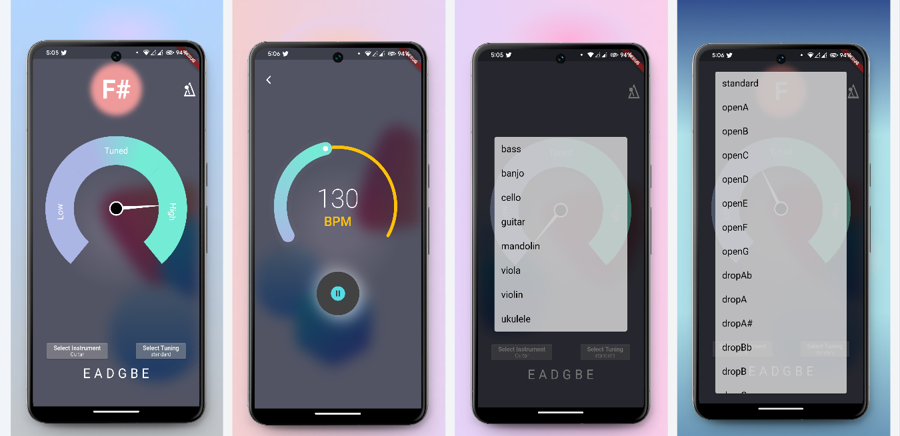
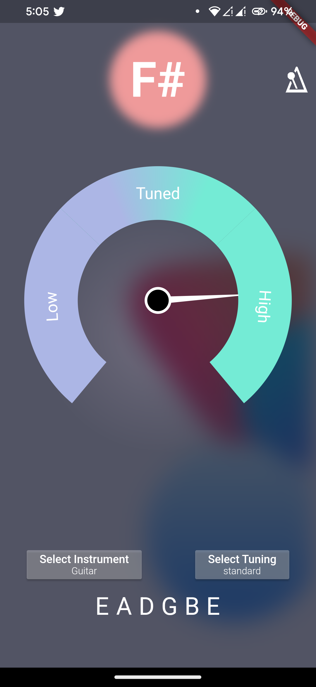
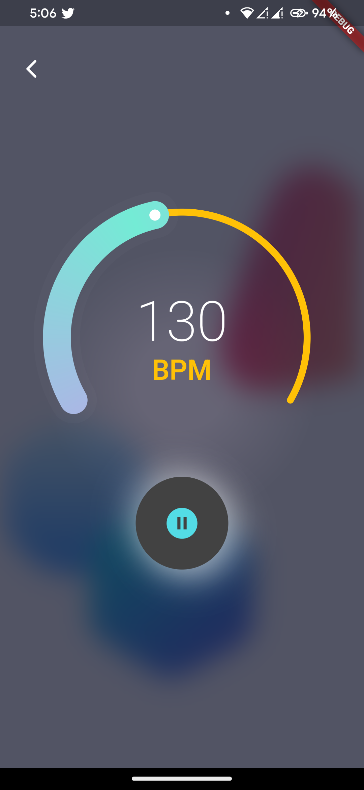
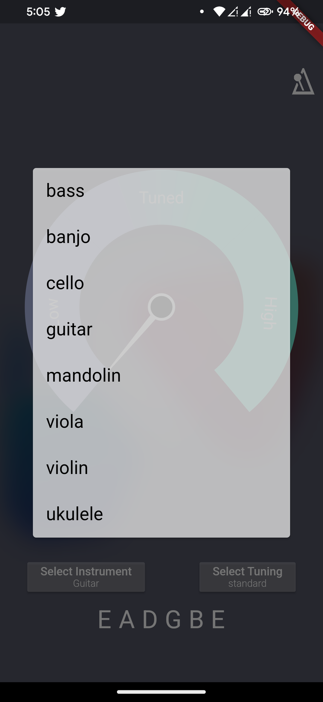
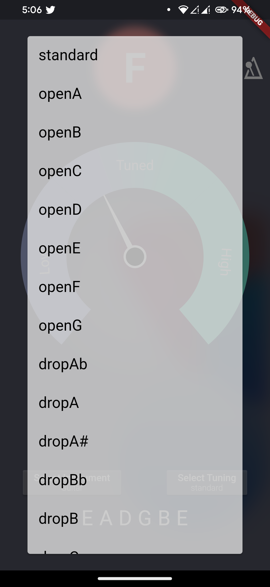

# OnTune

Guitar Tuner And Metronome

OnTune is a powerful and user-friendly app designed to elevate your music practice. It combines a high-precision guitar tuner with a versatile metronome, offering everything you need to stay in tune and on time.

## Tuner

Chromatic tuning: Accurately tune any stringed instrument, including guitars, basses, ukuleles, violins, and more.
Multiple tuning presets: Choose from popular tunings or create your own.
Visual tuning guide: See your pitch in real-time with a clear and easy-to-read display.
Built-in microphone: No need for external cables, tune directly from your phone.
Adjustable calibration: Fine-tune the tuner to match your instrument and A4 reference pitch.

## Metronome

Wide range of tempos: Practice at any pace from 30 to 300 beats per minute.
Variable time signatures: Choose from common time signatures like 4/4, 3/4, and more, or create custom rhythms.
Sound and visual cues: Hear the beat clearly through your phone speaker or headphones, and see it displayed visually on the screen.
Accent patterns: Emphasize specific beats for complex rhythms.
Count-in: Set a pre-measure count-in to get you started on the right foot.
Additional Features:

Clean and intuitive interface: Easy to navigate and use, even for beginners.
Customizable settings: Tailor the app to your preferences with various options for sound, display, and more.
Compact and portable: Practice anywhere with the app's convenient size.

## Screenshots
Tuner             |  Metronome
:-------------------------:|:-------------------------:
 |  
 |  

